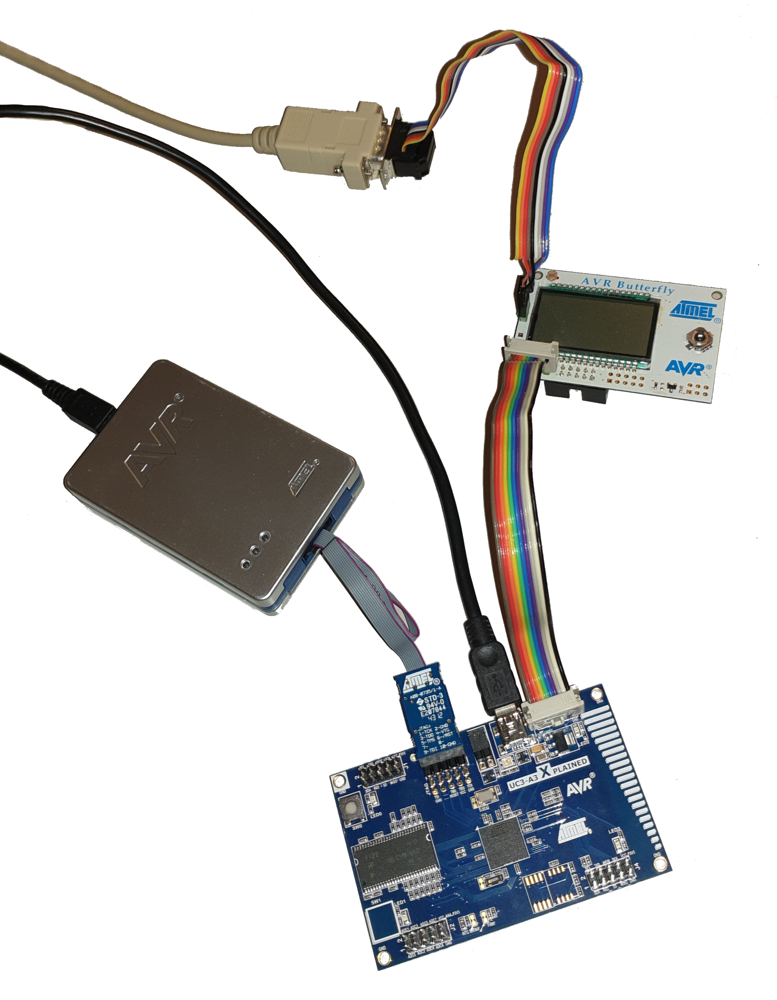

# TTK4147 - Real-time Systems  

## Exercise - AVR32 UC3 and BRTT

We will take a break from programming in Linux for now, and instead use the
AVR32 UC3-A3 xplained card. The AVR32 UC3 is a simple 32-bit microcontroller,
that is similar to the AVR 8-bit microcontroller some of you already have
experience with. Just as the 8-bit AVR, it can run C-code directly on the
microcontroller without an operating system.

Despite this being a course about real-time operating systems, there are some
things that are more easily demonstrated when programming bare-bones without an
operating system. It also lets us establish a baseline for comparing performance
and ease of programming when we in the next exercise will be using an operating
system on the same platform.

This exercise will introduce the Butterfly Real-Time Tester (BRTT), which is an
AVR evaluation kit modified to test the response times for external input
events. We will be using the BRTT in several of the next exercises, so make sure
to save your measurements in order to compare results in later exercises.
REMEMBER TO BACK-UP ALL YOUR DATA WHEN YOU ARE FINISHED FOR THE DAY.
Documentation for the BRTT can be found in this repository. Do not attempt to
reprogram the Butterfly, as it might give incorrect results.

If you have questions or want to get your assignment approved, please apply for
a spot (using your NTNU-user) in the queue here: <https://s.ntnu.no/rts>.

## Developing with AVR32

### Running test application

This exercise assumes that you use Microchip Studio on Windows. The template
project is available in this repository (`AVR32 Template`). It is very important
that the repository is cloned on the local disk, otherwise you will get build
errors. You will be prompted to update the project, do this. The AVR32 UC3
should be connected to the PC and JTAG as described in the Getting Started guide
you can find online, which is also demonstrated in Figure <a
href="#fig:demonstration_connection" data-reference-type="ref"
data-reference="fig:demonstration_connection">1</a>.

Additional information about the card can be found in the Hardware User’s Guide.
When the card is connected, you can click the outlined green play button in
Microchip Studio ("Start without debugging, Ctrl+Shift+F5) to build the test
application, program the card and run the application. If there is a message
that the JTAG tool must be upgraded, just follow the instructions on screen.

When the program starts running on the card, a LED will start blinking every
second. Instead of clicking the outlined green play button to run the program,
you can also click the filled green play button to start with debugging. If you
have added any breakpoints, the execution will pause once you reach them (or you
can manually pause at any time), and from there you can step through the code
one line at a time.

### Serial debugging

As you likely noticed, there is a call to `printf()` in the test application.
The call to `stdio_usb_init()` directs the standard input and output streams to
the usb-to-serial device, letting you print to a terminal on the lab PC.

Open the program Putty to read the serial output. Find the serial settings and
set the baud rate to 115200, 8 data bits, 1 stop bit, no parity and no flow
control. You can figure out which COM port it is by checking the device manager,
or by trial and error. In order to make the formatting correct you also have to
tick the "implicit CR in every LF" box under "Terminal" in the main menu. If
everything works correctly, it should now print “tick” every second, if not, you
can disconnect and connect the usb cable to the AVR32 (restart it).

Unfortunately the AVR32 UC3 doesn’t behave exactly as a normal serial port. The
problem is that if you now reprogram the AVR32 from Atmel studio, the printing
might stop working. Try restarting both Putty and the AVR32 to fix the problem.

Remember that `printf()` is a slow function that will significantly influence
the timing behavior of your program. Any prints used for debugging should be
disabled when performing the response time tests.

### AVR32 project description

The `main.c` file contains the `main()` function which runs when the application
is started on the AVR32. This is the only file that you should edit in this
exercise.

The `main.c` file starts with including `asf.h` (which again includes a large
number of other header files) and `busy_delay.h` (which implements micro- and
milli-seconds busy wait functions). The Atmel Software Framework (ASF) files are
libraries that have functions you can use instead of doing low level register
programming, as you would otherwise have done if programming an 8-bit AVR.

After the includes, there are several defines, the first one is necessary for
USB to serial, while the rest define the general-purpose I/O pins of the J3
header that you will use in this exercise. The `init()` function initializes the
LEDs and buttons on the card, the interrupts, USB to serial and busy wait
delays. This function must be run at the start of the `main()` function, and
should not be edited.

The `interrupt_J3()` function is a interrupt handler that can be configured to
run based on the pins on the J3 header. This will be explained when interrupts
are introduced. The `main()` function starts by running the `init()` function,
which should always be there. After the point of calling `init()`, you can
change the code as you like. Of the other files in the project, you only need to
be aware of a few of them:

- The files in `asf/avr32/boards/uc3_a3_xplained` folder initialize the card.

- The files in `asf/avr32/drivers/gpio` defines functions for using the general
  IO pins of the card, including the J3 header which we will use to connect to
  the Butterfly.

- `busy_delay.c` and `busy_delay.h` are provided as easy to use busy wait delay
  functions. These are modifications of the original files for delaying found in
  `asf/avr32/services/delay`.

## AVR32 UC3 reaction time

The BRTT reaction test measures the time a system uses to react to an external
"real world" event. This is an important property of real-time systems. The BRTT
can evaluate any system that has simple digital IO pins. In this course we will
test different systems and techniques for responding to one or several signals
as consistently as possible.

By doing the same test a large number of times, we will get a distribution of
response time. For real-time systems, the worst-case response time will be more
important than the average. If we consider a real-time system that controls the
brakes of a car, an average response time of 1 ms is of no interest if the
worst-case response time is so high that it will cause accidents.

We will use the BRTT to test the reaction time of the AVR32 UC3 device. The test
consists of the BRTT sending signals that the AVR32 UC3 should notice and
respond to as soon as possible.

### Connecting the BRTT

<figure>

<figcaption aria-hidden="true">Demonstration of BRTT
connection</figcaption>
</figure>

Figure <a href="#fig:demonstration_connection" data-reference-type="ref"
data-reference="fig:demonstration_connection">1</a> shows how the Butterfly can
be connected to the AVR32 card. This will both power the Butterfly and connect
the necessary I/O pins. The Butterfly should also be connected to the PC with
the provided cable and a normal serial cable. The BRTT prints the results of the
test to the serial line, and you should use Putty to get hold of this data. The
serial port is COM2 and the baud rate is 9600, 8 data bits, 1 stop bit, no
parity and no flow control.

This repository contains a user manual for BRTT and a spreadsheet for analyzing
the results. The results are formatted so they can be pasted directly into the
spreadsheet, which will show the distribution of response times in a histogram.
Since you have to keep the results for comparison, it is suggested that you push
your excel sheet with results to this repository. The template has different
sheets in the lower left corner, familiarize yourself with all of them.

To paste the data from Putty properly into Excel you have to paste it and with
all the rows selected go to "Data" and select "Text to columns". Then select
"Delimited" $\rightarrow$ "Next", tick the "space" and "treat consecutive
delimiters as one" boxes and untick the others. Finally, press "finish".

Since the different systems we will test will have quite different response
times, you will have to set an appropriate time scale. If you choose a scale
that is too low, the results that are higher than the scale will be shown in the
rightmost column. To see the whole distribution, the rightmost column should
ideally be zero.

#### TASK A

The simplest way to respond to the reaction test is with a busy-wait that
continuously reads the input pin, waiting to discover a signal. As the name
implies, the program is busy while it is waiting for a signal, preventing the
processor from being used for anything else that might be useful. Because of
this, the busy-wait approach is usually avoided. We will start with a test of
type A, meaning that only one signal is sent from the BRTT. The BRTT signals the
AVR32 by setting the TEST A pin low. The AVR32 should then set the RESPONSE A
pin low as soon as possible.

The pins for the BRTT should be configured and used in the same way as the pins
for controlling the LEDs on the card, which are found in `board_init()`. Try
marking this function and pressing alt+g. This should show how this function is
implemented, taking you to `/src/asf/avr32/boards/uc3_a3_xplained/init.c`. Then
try looking up the source for `gpio_toggle_pin()` in the main function to find
appropriate methods to read and writing the pins.

Create a program that uses the busy-wait technique to respond to a test of type
A only. Here’s some pseudocode to get you started:

```
    loop forever: 
    wait until testA = 0 
    response A = 0 
    while testA = 0 do nothing // hold the signal low until the BRTT reads it 
    response A = 1
```

Perform a reaction test with the BRTT. When copy-pasting the results into the
spreadsheet, it should look something like Figure <a href="#fig:calc_example"
data-reference-type="ref" data-reference="fig:calc_example">2</a>.

<figure>

<figcaption aria-hidden="true">Example of spreadsheet
results</figcaption>
</figure>

Be careful to get row and columns correct, or it will not work. The "Paste
here…" text should be replaced with "Reaction test". In the graphs sheet you can
see the time distributions of up to six different tests. You can also adjust the
time scale, so the data fits well inside the graphs. There is also a compare
sheet that is one large diagram comparing up to six tests.

#### TASK B

Extend your application, so it checks all three TEST signals (A, B and C) and
sets the corresponding RESPONSE signal if a signal is detected. Do a reaction
test with at least 1000 subtests of type A+B+C, and save the results in the
spreadsheet.

The BRTT will make a noise when running a A+B+C test, because the pins used for
the C test shares pins with the speaker on the back of the BRTT. This does not
affect the test.

Compare the results from responding to only the A test and responding to all
three.

Which one has the lowest maximum? Why?

Does the response for A, B and C look the same?

### Interrupts

As mentioned before, polling is generally avoided since it wastes CPU resources
(and power). Using interrupts is often a preferred solution, especially for a
platform like the AVR32 UC3 where interrupts are very easy to set up. If a pin
is configured with an interrupt it is monitored without disturbing the rest of
the program on the AVR32. When a signal is detected, the main process is paused
and an interrupt handler function is called.

Half of the job of setting up an interrupt has already been done in the `init()`
function and since the `interrupt_J3()` function has been prepared. In addition
to this, you must register each of the pins you use as an interrupt, using the
`gpio_enable_pin_interrupt()` function.

If you register more than one pin as interrupt, they will all run the same
interrupt handler function. You must therefore check which of the pins have an
active interrupt flag in the interrupt handler function, with the function
`gpio_get_pin_interrupt_flag()`. When you have identified which gpio that has
the active flag, it must be cleared using `gpio_clear_pin_interrupt_flag()`.

#### TASK C

Create a program that responds to the A+B+C test using interrupts instead of
polling. Save the results in the spreadsheet.

How do the timings compare to the polling solution? Do A, B and C have the same
response time? Why/why not?

### Big while

Since interrupt handlers are run immediately, they are effectively "high
priority tasks" that block other tasks (or other interrupts) from running.
Therefore, it is generally good practice to spend as little time as possible in
an interrupt handler. When responding to this reaction test, this is not really
a concern since we only do a few things in the interrupt handler.

So let’s just pretend that we have a time-consuming calculation to perform when
an interrupt happens. In order to not block other interrupts from being handled,
the interrupt handling for the "slow" events should only set a flag
corresponding to the pin that got the signal. In the main function, we have a
"big while loop" that checks for the different flags, and runs code for
responding to the interrupt. Remember to clear the flag after use.

When a normal function and an interrupt are using the same global variable, it
should be declared as volatile or else the compiler may make some optimization
assumptions that aren’t valid.

#### TASK D

Before trying this technique, stay with the interrupt technique you used
previously in Task C, but make the processing of a type B event "expensive" by
adding a call to `busy_delay_us(100)` before responding to it. Save the results.

Then create a program that responds to the A+B+C test using deferred interrupt
handling in a big while loop. First do it without the extra "expensive"
calculation for the B response, then with. Save both results.

Now compare all four scenarios: "expensive B" vs. "fast B" response, immediate
processing in interrupts vs. deferred with a big while loop.

For the deferred technique: Is it faster or slower, and why?

For the "expensive B" response: Which solution had the least impact on the
response for A and C?

#### TASK E (optional)

Combine any of the methods you used in this exercise to optimize your program
for minimal and least variable response times for all A+B+C events, where the B
event still includes the slow 100us "calculation".
