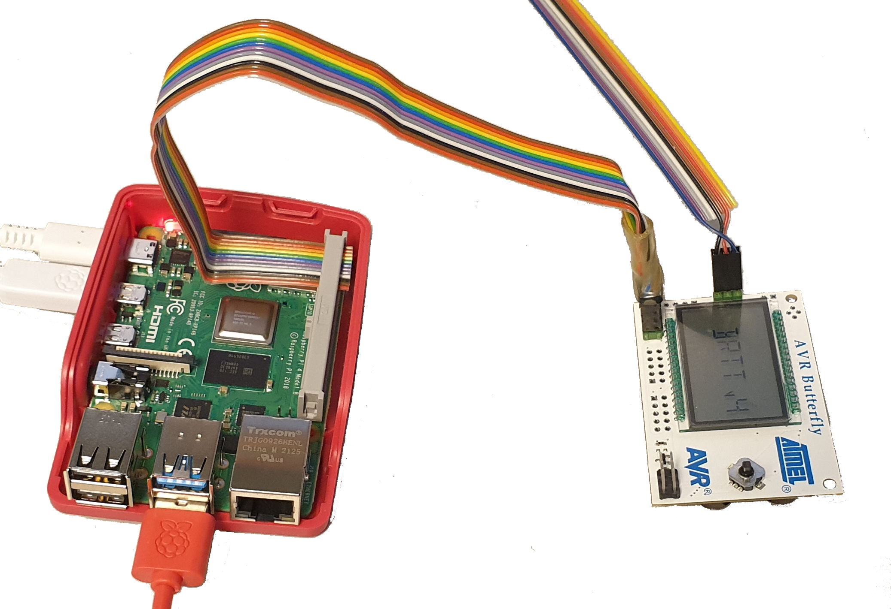

# TTK4147 - Real-time Systems  

## Exercise - Linux and BRTT

In this exercise we will use the Butterfly Real-Time Tester to test the
Raspberry Pi OS installed in RPi. We will do similar tests as we did in the
previous exercises with the AVR. If you have questions or want to get your
assignment approved, please apply for a spot in the queue here:
<https://s.ntnu.no/rts>.

## I/O connection

The interface between the RPi and the BRTT consists of digital I/O signals,
passing through a ribbon cable connected as shown in Figure <a
href="#fig:BRTT_connection_example" data-reference-type="ref"
data-reference="fig:BRTT_connection_example">1</a>. The signals from the RPi can
be controlled through a library called `wiringPi`. This library has to be
installed by the following procedure:

1. Download the archive.

```shell
wget https://github.com/WiringPi/WiringPi/archive/refs/tags/3.10.zip
```

2. Unpack the file.

```shell
unzip ./3.10.zip
```

3. Go into the unpacked directory and build the library.

```shell
cd WiringPi-3.10
./build
```

<figure>

<figcaption aria-hidden="true">Connection of BRTT to RPi.</figcaption>
</figure>

In order to initialize everything properly, it is recommended that you run the
following initialization code in the beginning of your program.

```c
#include <wiringPi.h>

#define PININ1  8
#define PINOUT1 9
#define PININ2  7
#define PINOUT2 15
#define PININ3  16
#define PINOUT3 1

void io_init( void ) {
    wiringPiSetup();
    
    pinMode (PININ1, INPUT); pinMode (PINOUT1, OUTPUT); 
    pinMode (PININ2, INPUT); pinMode (PINOUT2, OUTPUT); 
    pinMode (PININ3, INPUT); pinMode (PINOUT3, OUTPUT); 
    
    digitalWrite(PINOUT1, HIGH);
    digitalWrite(PINOUT2, HIGH);
    digitalWrite(PINOUT3, HIGH);
}
```

In the later parts of this exercise, we will be using some library functions
that only compile with GNU extentions enabled. You will need to use the compiler
flags `-std=gnu11`, `lwiringPi`, `lwiringPiDev` and set `#define _GNU_SOURCE`
before including the linux header files to enable these. You also need to use
the `clang` compiler in order to compile your code.

To read the serial output of the BRTT, you can use the Windows PC the same way
as you did in the previous exercises.

## Reaction test using busy-wait

We will start by doing a reaction test where we busy-wait of the input pin. For
some interesting reason, the BRTT sometimes overflows even though the program
works as it should. To fix this, you have to unplug the connection to the RPi
and connect it again.

#### TASK A

Create 3 POSIXs threads, one for each of the tests A, B and C. Each thread waits
until it receives its test signal, and then it will send its response signal
back. Run a test of 1000 subtests and store the results.

If you get valid results in many subtests, but then suddenly there is an
"overflow", it means that the system was not able to reply within the 65
milliseconds that the BRTT waits for replies (version 3). You can probably run
another set of tests and that will be able to complete. If this is a consistent
problem, there is a problem with your code.

### Comparing single-core and multi-core

The RPis have quad-core CPUs. The speed of the CPU and the fact that it can run
three processes or threads in parallel will to some degree mask poor real-time
scheduling for us. To get more relevant results that differentiate between good
and bad real-time performance, we need to make some changes to our program.

#### TASK B

First of all we want to run everything on the same CPU core. The following
function can be called in the start of a spawned thread function, and will
ensure that the thread only will be executed on the specified CPU core.

```c
#include <sched.h>

int set_cpu(int cpu_id)
{
    int num_cores = sysconf(_SC_NPROCESSORS_ONLN);
    if (cpu_id < 0 || cpu_id >= num_cores)
        return EINVAL;

    cpu_set_t cpu;
    CPU_ZERO(&cpu);
    CPU_SET(cpu_id, &cpu);
    return pthread_setaffinity_np(pthread_self(), sizeof(cpu_set_t), &cpu);
}
```

Run the same test as in A, with all threads on the same CPU core, and record the
results for an A+B+C test with 1000 iterations.

Compare the results between running on a single core and all four. Compare the
shape of the distributions: do any of the histograms have any particular spikes,
and why?

Which one has the best worst-case response time, and why?

### Adding disturbances

In addition to forcing all threads to run on the same CPU-core, we will also
create additional threads that run on the same core just to disturb the
application. Each of these disturbance threads should set themselves to run on
the same core, before starting an infinite loop of either some simple
calculations, or just

```c
while(1){
    asm volatile("" ::: "memory");
}
```

#### TASK C

Spawn 10 disturbance threads running an infinite loop, on the same CPU core as
the response task threads. Record those results - again, an A+B+C test with 1000
subtests. Are you able to get all 1000 subtests to run? How many disturbance
threads can the system handle without getting overflow on the BRTT? Hint: it
should be less than 10.

We will get back to comparing these results in task D.

## Periodic POSIX threads

In order to make a thread execute periodically, we will use the function

```c
clock_nanosleep(CLOCK_MONOTONIC, 0, &ts, NULL);
```

For example:

```c
void sleep_realtime(long nanoseconds)
{
    struct timespec ts;
    ts.tv_sec = nanoseconds / 1e9;
    ts.tv_nsec = nanoseconds % (long)1e9;
    clock_nanosleep(CLOCK_MONOTONIC, 0, &ts, NULL);
}
```

With these functions you should be able to create a periodic `pthread`, test
this by creating a thread that prints a message every 500ms or similar. You
might need to use `fflush(stdout)` to get the results printed in the terminal
window. Remember to add `#define _GNU_SOURCE`.

#### TASK D

Create three tasks that periodically poll the test signal from the BRTT, and set
its response signal as soon it receives it. The period should be 2ms, but feel
free to experiment with shorter periods. What happens if the period is too
short?

As before, you should run all threads on the same CPU. Do an A+B+C reaction test
with 1000 subtests, with and without disturbance. Compare the four results:
busy-polling the input vs periodic execution, both with and without disturbance:

Without the disturbance enabled - which one has the fastest response, and why?

Which one is less impacted by the addition of the disturbance, and why?

When the disturbance is enabled - do any of these have a predictable and
consistent worst-case response time?
